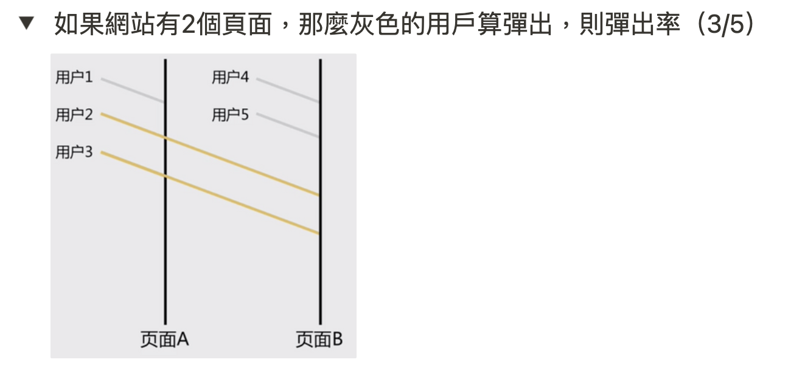
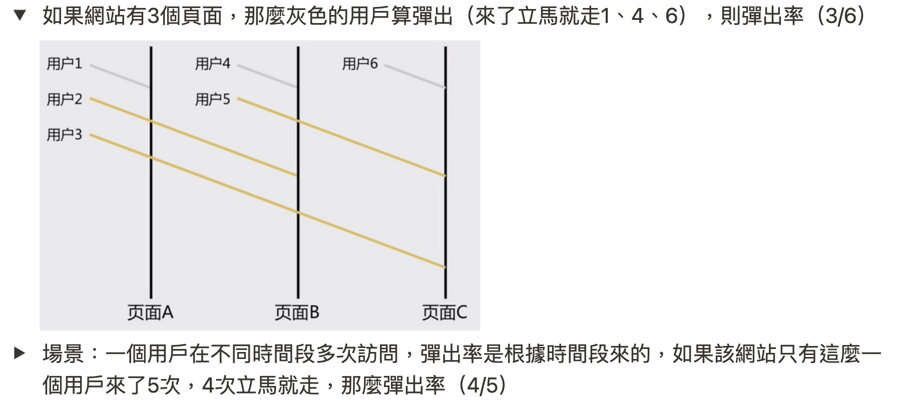

# Ref

https://www.notion.so/014b5054ae7141e3866312a1d3a65b68

# DAU/MAU

define active :

1. 基於事件 --> 有xx事件發生 --> 該使用者活躍
2. 關鍵事件 --> 有xx事件發生(業務定義) --> 該使用者活躍
3. 自然日(產品有沒有跨時區?)
   1. 每天早上 0800
4. 00:00 開始

坑 : 

1. MAU != sum of DAU (務必去重複)
2. 後台 前/後端 發送特殊事件、污染資料

# 按人計算 or 按設備計算

* 單個 user - 多個設備
* 一個設備 - 多個 user

1. 有沒有帳號體系
   1. No --> 認設備
   2. 有 next
2. 業務場景是否依賴登入
   1. Yes -> 認人、認設備
3. 不登入的使用者對業務是否有價值
   1. No --> 認人 + 認設備
   2. Yes --> 認設備就好

# PV / UV / Convertion Rate / Depth

1. PV/UV
2. PV/PV
3. UV/UV

# Bounce Rate

</img>

</img>

</img>

* 以上行為通用在 GA / 電商網站 --> `跳出 Website`
* unit : session (GA 定義是 30 分鐘)
* keypoint : 定義重要行為
  * 只看了一頁就離開 --> 對電商是重要的沒興趣的行為(landing page 並非結帳頁)
  * 對我們的網站的重要行為是什麼?
  * 頁面的 bounce rate

# Session

Mobile - 72s

Desktop - 155s

* 多久滑到文章的一半 / 文章的 75%

# 如何增加閱讀深度

1. 大的題目 (by search)
2. 偏向打發時間 - by categories / tags
3. 搜尋適合 maximize CTR、推薦可以考慮 maximize session time (reading depth)
4. 單篇 / 懶人包