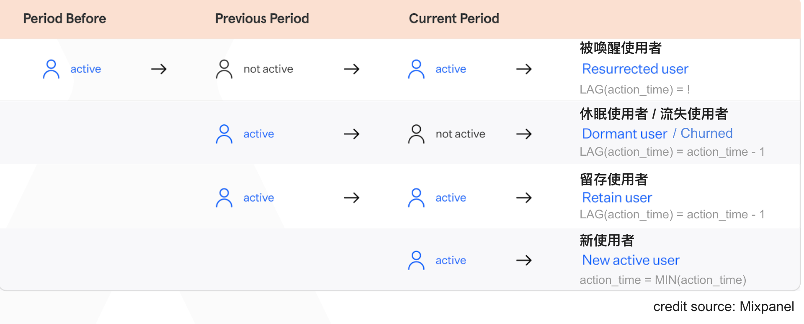
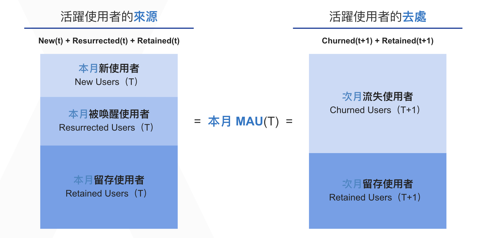
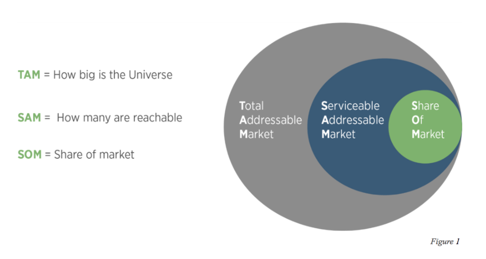
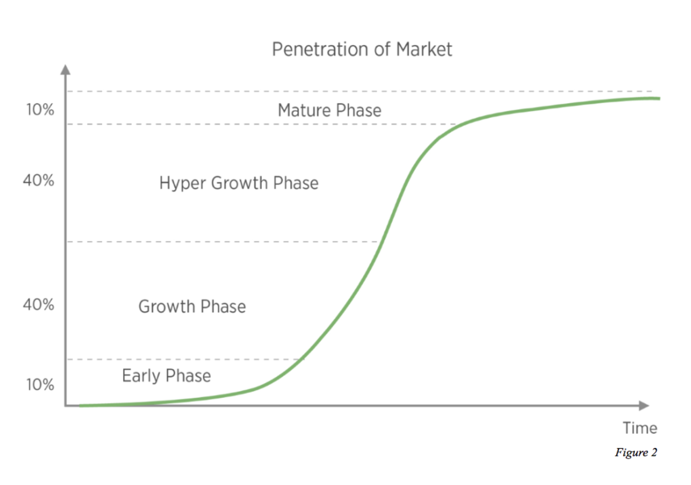
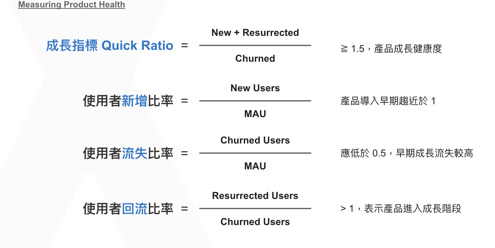

# Active User versus product growth

* [Ref](https://docs.google.com/presentation/d/1xTd4tK_o9vfQvUOQMgYMbMYAItd3bn-g5VPiMxaV9BU/edit#slide=id.g1098e4afe29_0_7)

## Active User

* [How can I track new users, resurrected users, retained users, and dormant users? - credit source - Mixpanel, ethan](https://mixpanel.com/content/guide-to-product-analytics/chapter_3/#track-new-resurrected-retained-dormant-users)

</img>

## User Status with time

</img>

at time : $T$ 

New(新使用者) + Resurrected(被喚醒的使用者) + Retained(留存使用者) = 活躍使用者$(T)$

at time : $T+1$

活躍使用者$(T)$ = Churn (流失使用者) $(T+1)$ + Retained (留存使用者) $(T+1)$

# Estimate your Market Size

[Measuring Product Health](https://medium.com/sequoia-capital/measuring-product-health-626b2186cece) - credit source: Sequoia

1. num of active users is the truest measure of your product's impact
2. what is total addressable market(TAM) of your product?
3. how much of the market share does your competitor have?

</img>

# Product Growth and Market Penetation - 產品成長歷程和市場滲透

</img>

$x$ : time

$y$ : penetration(市場滲透率)

Q : 如何計算市場滲透率?
A : Share of Market 

e.g. $y$ ~ $SOM$ = $\frac{貴司佔有的版位數量}{總版位數量}$

# Product Health Metrics

</img>
