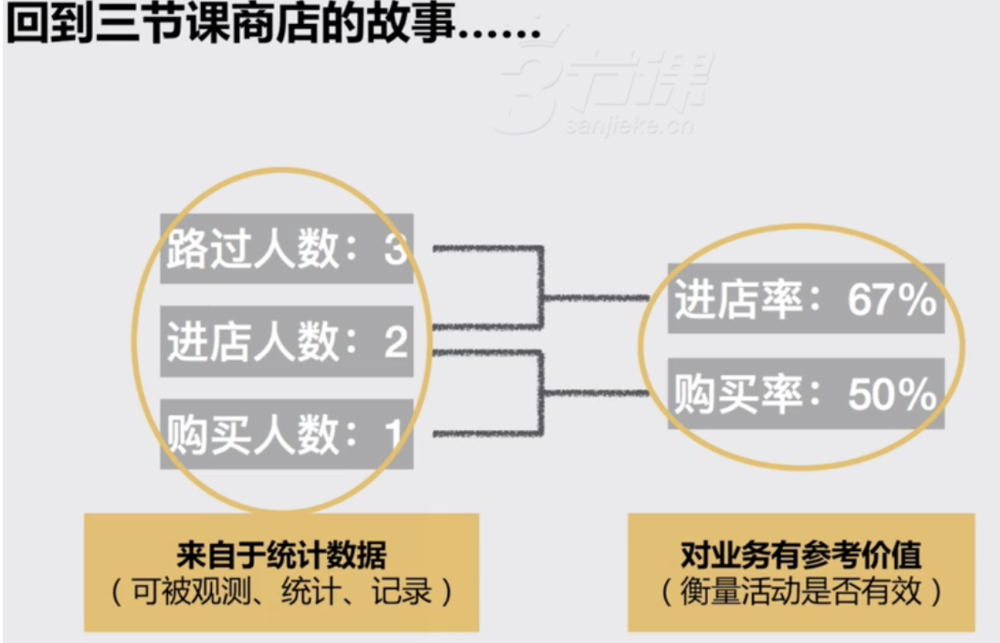
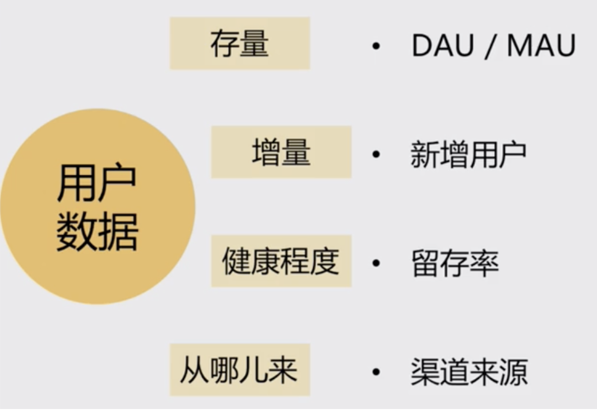
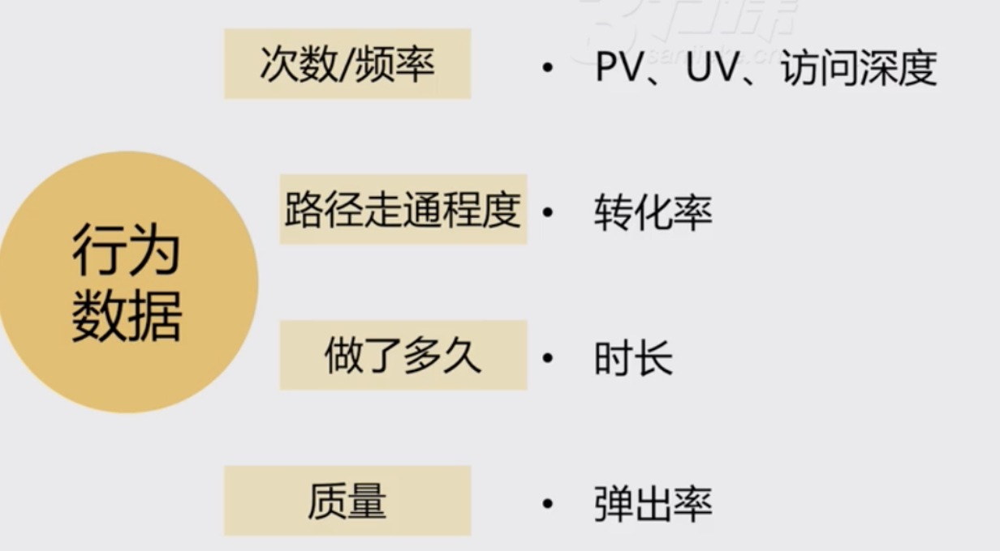
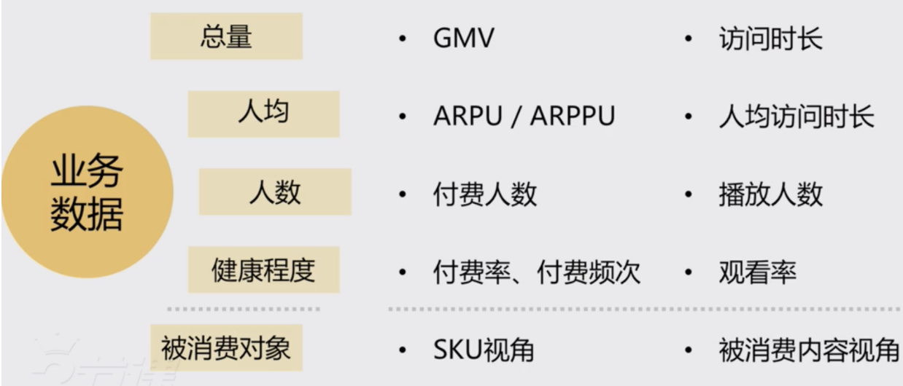

# Metrics

[ref](https://www.notion.so/014b5054ae7141e3866312a1d3a65b68)

1. 怎麼選指標
2. 常用指標和定義
3. 日常工作中，指標有什麼坑

業務場景 : 

1. 老闆將一個剛剛上限的社區產品交給A, C 兩位 PM ，並且問最近產品表現如何

A : 很不錯，日活躍使用者(DAU)每天都在漲，新增也很多

C : DAU 按照設備數來看一直在漲，但如果看註冊使用者數量並不樂觀，新增使用者轉換成註冊使用者的只有20%，說明我們的產品目前沒有促使使用者註冊的動機

2. 三個月後，老闆想是否要開始推廣...

A : 最近 DAU 平穩，已經沒有剛開始那麼多新增使用者了，要不要推廣我拿不準；
C：最近日活雖然上漲趨勢不大，但
  1. 使用者人均發帖量相比剛上線時翻了一番；
  2. 使用者間的好友密度相比一個月前也增長了30%，我覺得社區的氛圍已經形成；
  3. 這個從新使用者次日留存由上個月的35%漲到50%也能得到驗證；
  
  因此，我認為可以開始大規模推廣。

# What is Metrics 

* 對當前業務有價值
* 可統計

</img>

# Common Metrics - Segment

</img>

## User Metrics

</img>

NOTE: user 可以是任何一種user，例如 讀者 or 創作者(部落客、youtuber、ig網紅) or 商家

## Behavior Metrics

</img>

## Business Metrics

</img>

* 直接和營收掛鉤的指標
* 和被消費內容互動相關指標