# Overview

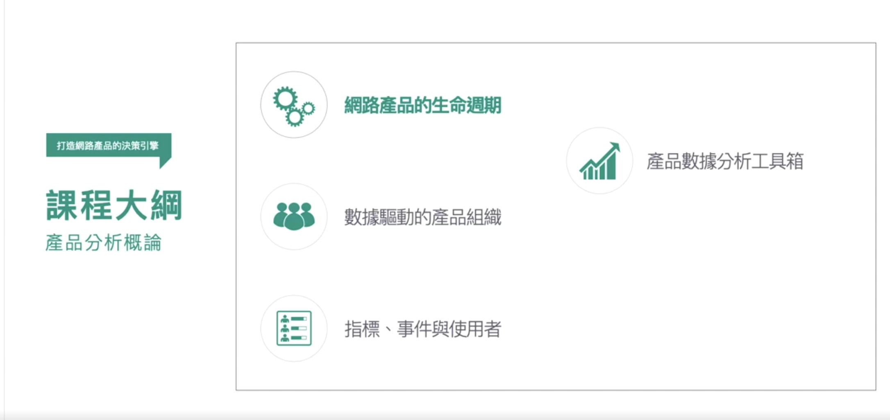</img>

## 網路產品的生命週期

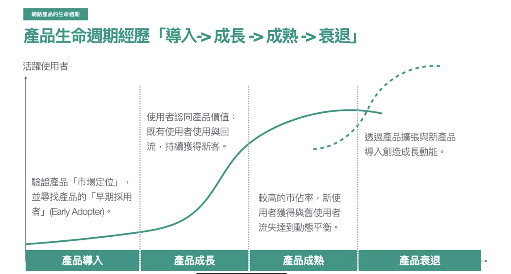</img>

1. e.g. FB 已經試了各種方法，無法再增加AU，可能就會有買下Instgram的行為，直接整包帶走

case : 

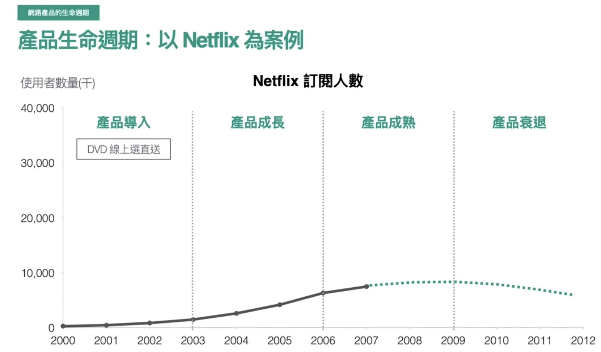</img>

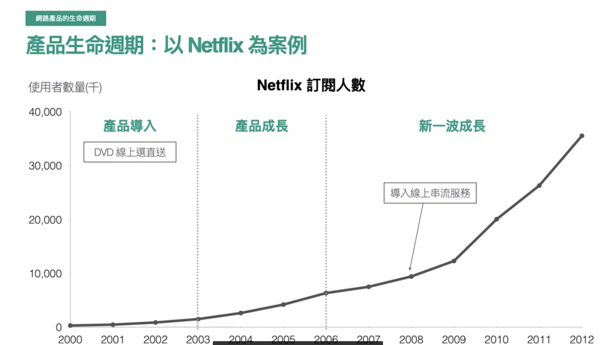</img>

如果 netflix 不做新的市場佈局，可以預測在 09 年將會開始邁入產品衰退，但後來我們都知道，netflix 展開了線上串流的服務，帶來一波新的使用者成長

## 導入期 - 找到產品的市場定位(Product market fit)

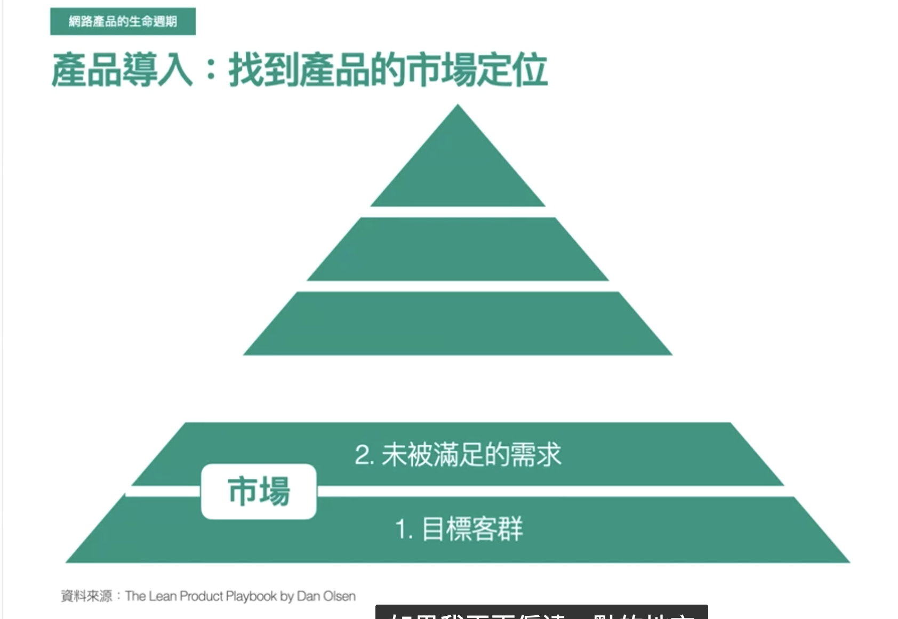</img>

such as uber

TA - 1 : 想搭車的人

* 台北 - 很容易攔到車
* 新竹 - 就算尖峰也很難欄到車
* 美國(地廣人稀) - 更難攔到車 - 想搭車的人希望可以獲得短程移動的能力

TA - 2 : 有車、也愛開車的人

* 載客更有趣(可以分享故事等)、喜歡載客
* 載客有錢賺

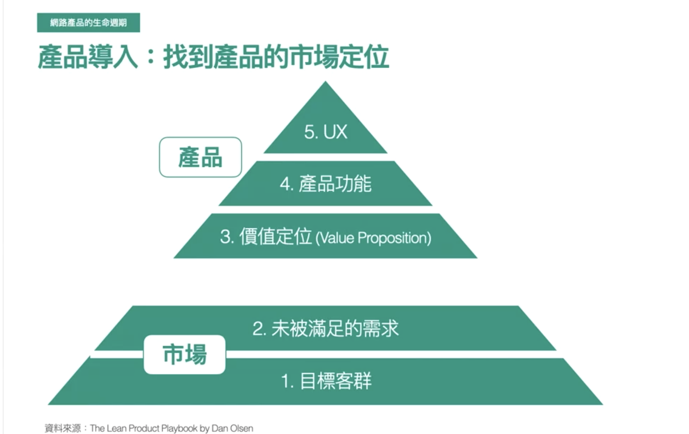</img>

**價值定位**

* 透過價值定位來宣揚自己的產品可以滿足什麼(任何公司都無法做一個大平台把未被滿足的需求全包下來)
  * uber - mobility - 讓所有人獲得移動能力
  * airbnb - belong to anywhere - 因此很重視使用者去到了異地的產品體驗，如次可以看出各個產品線的目的
    * 短租長租
    * airbnb+ (for VIP)
    * Tour Guide - 讓當地導遊帶你體驗
    * 線上體驗 - 就算在家也能體驗到異地文化(異地食物、異地運動、異地生活型態等)

**產品功能, UX**

* uber - 能否在 3 ~ 5 分鐘內叫到車?
* uber - 軟體服務是否滿意?

## fullfill product market fit.

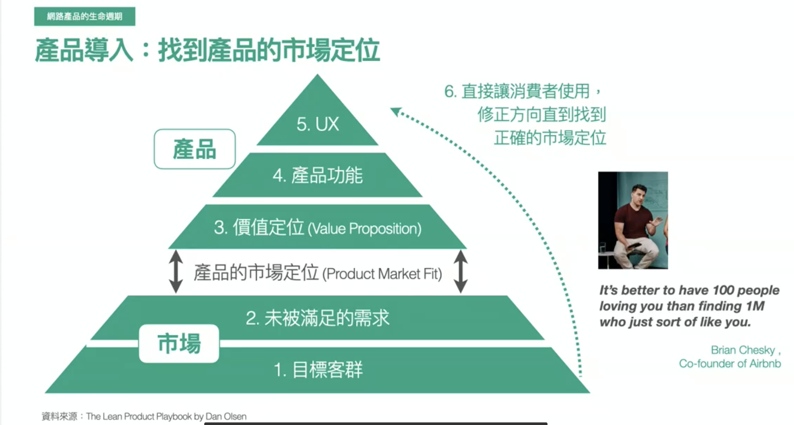</img>

無法一次到位 - 推出小產品、收集使用者反饋、持續修正產品

* DO剛開始建立產品時、最好有 100 個，非常喜歡你產品的忠心使用者
  * 仔細了解他們的需求和偏好 --> 調整產品 --> 擴張使用者基數
的使* DONT 100萬個 - 欸? 你的產品好像還不錯用用者

* 此時 - 質化分析重要
  * 了解使用者喜好
    * 使用者訪談
    * 問卷調查
  * 數據分析
    * 衡量產品是否有找到市場定位
    * 產品有哪些優化空間

## 數據分析 - 產品健康度

* 確認產品有明確的 market fit - retention rate
* 很多比較方式可以用
  * 同值性產品
  * 公司營運成本(e.g. 每個月要有 10k+ user 使用才可攤提)

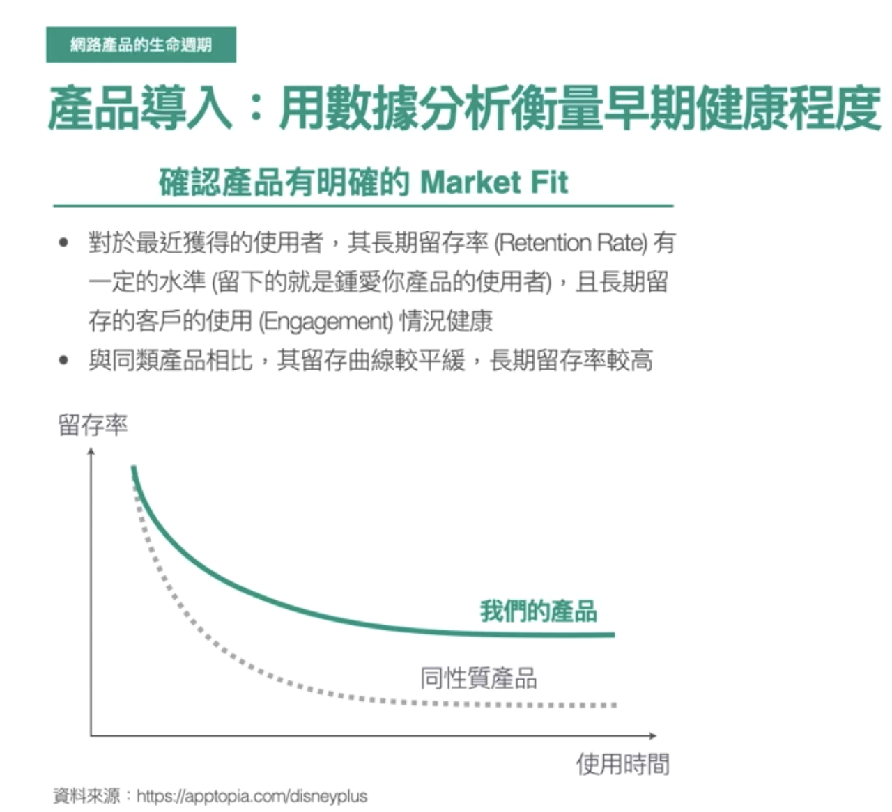</img>

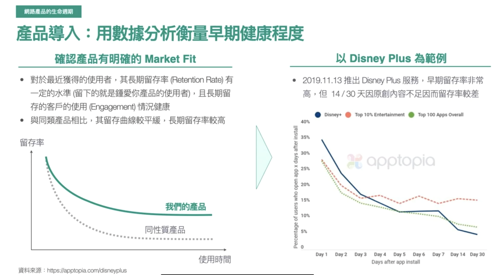</img>

ref : https://apptopia.com/disneyplus

# 產品成長 - 自主採用 & 擴散

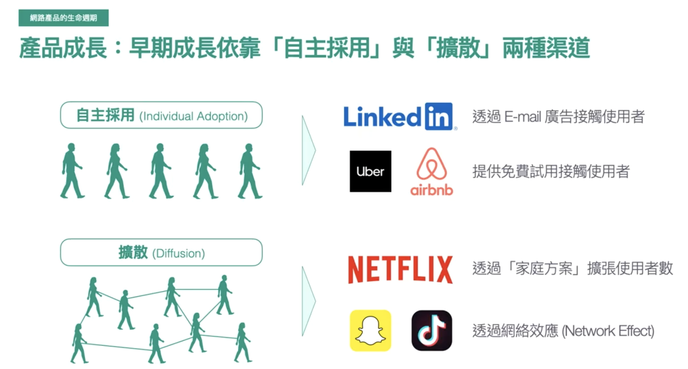</img>

* uber, airbnb 提供免費額度來吸引使用者自主採用
* 擴散 - tiktok 
  * 把很洗腦的影片上傳到 youtube --> 讓 youtube 變成渠道
  * 鼓勵使用者把洗腦影片上傳到 youtube --> same idea

# 產品成長 - 使用者持續使用

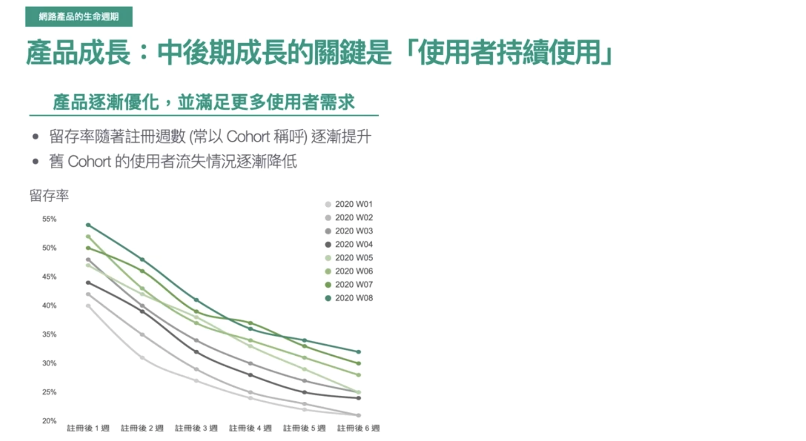</img>

灰色 - 舊的使用者
綠色 - 新的使用者

希望看到的現象 - 留存曲線逐漸上走(產品優化的方向確實有滿足使用者需求)

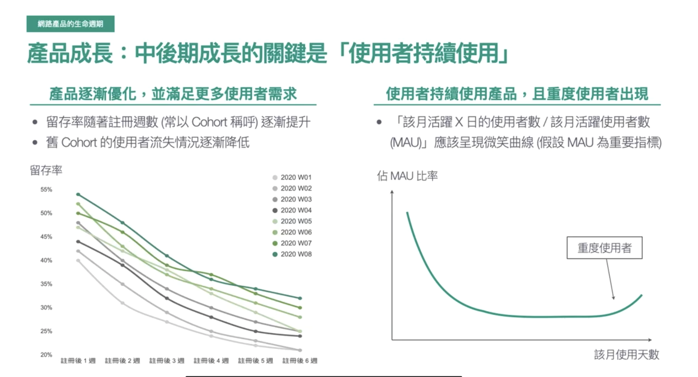</img>

Power User Curve

衡量重度使用者的數量

# 產品成熟

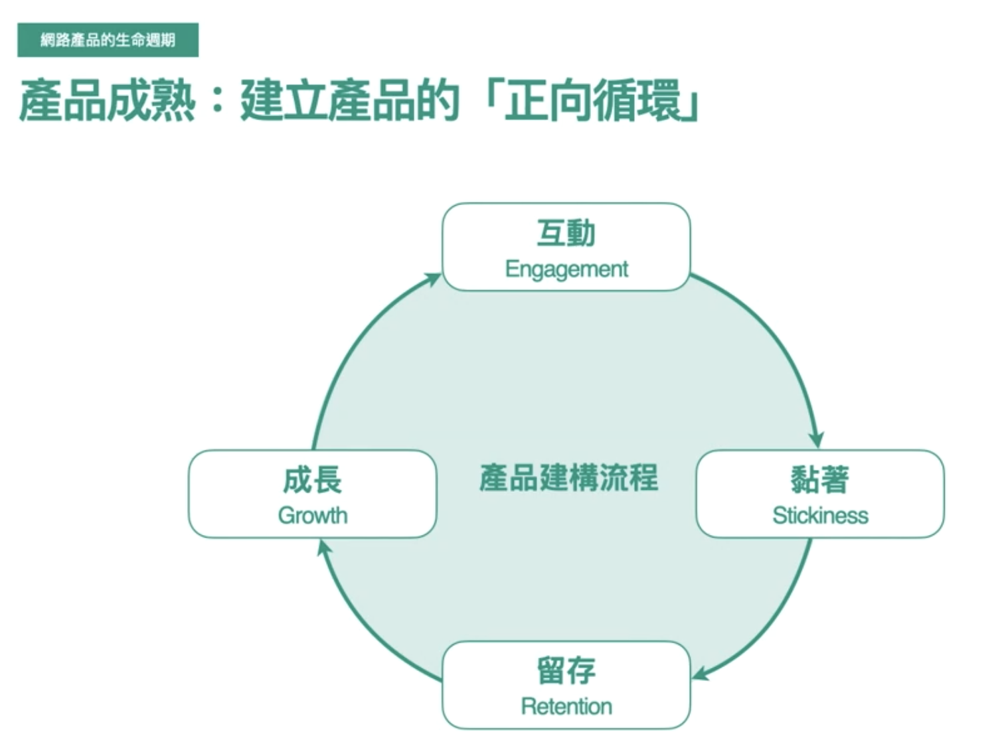</img>

* 互動 - 黏著 (個人化推薦 - Spotify & Netflix)
  * 當使用者喜歡你的產品、會進入app，但她們不之到線在要看神沒或是聽甚沒的時後 - 個人化推薦就很重要
* 黏著 - 留存
  * 黏著度高的使用者有著很高的留存率

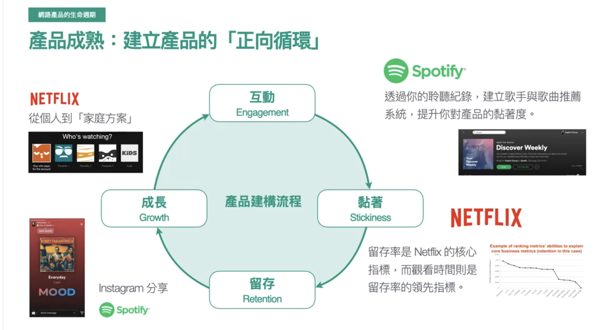</img>

# 產品衰退 : 透過擴張策略找到新的成長契機

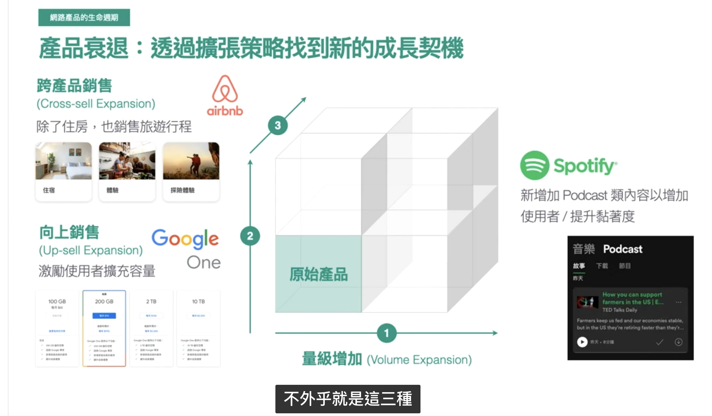</img>

* 聽音樂也愛聽 Podcast 的人 --> 增加多樣性
