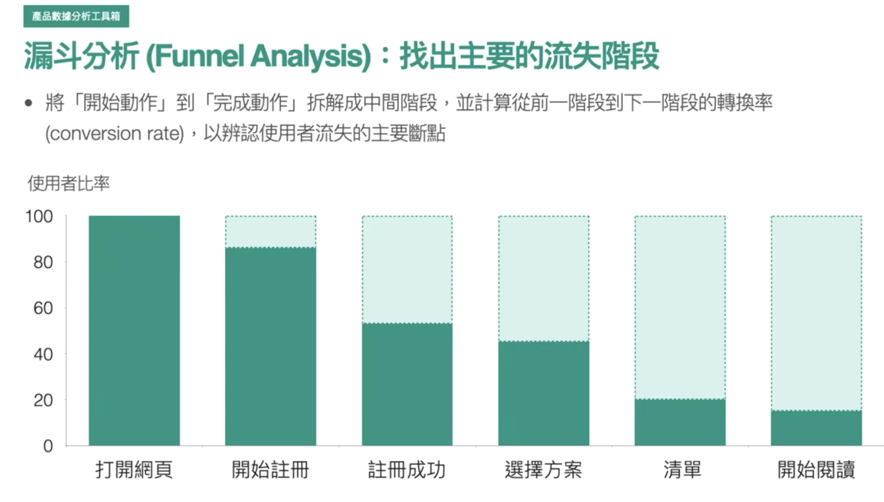
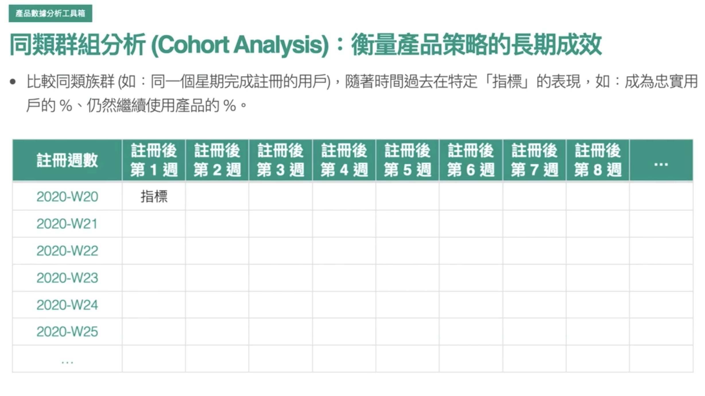
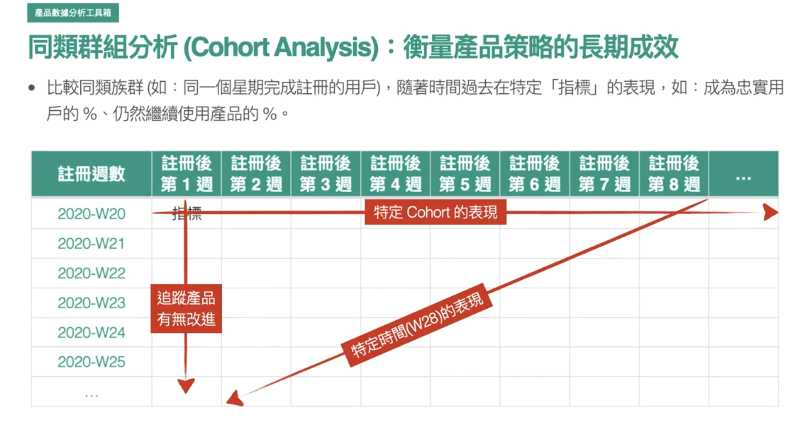
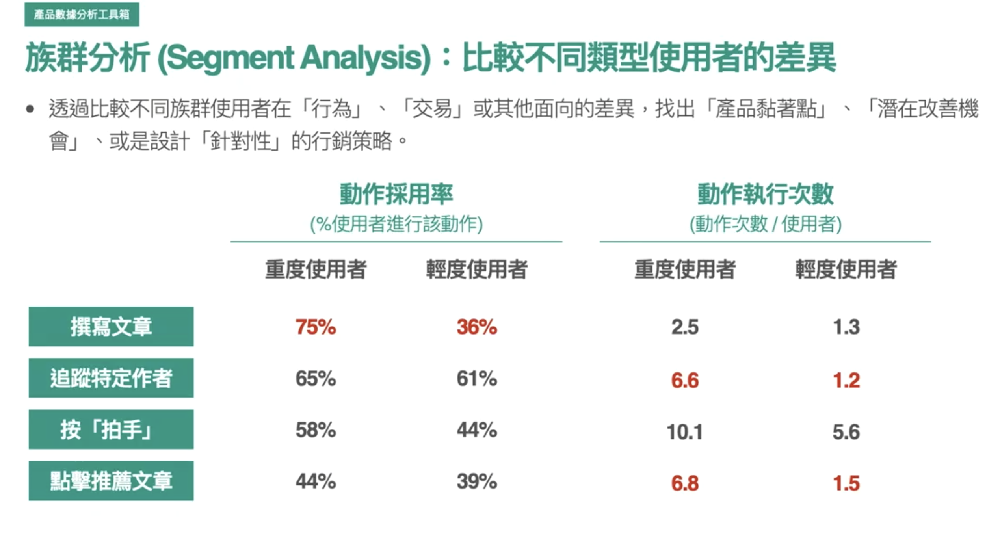
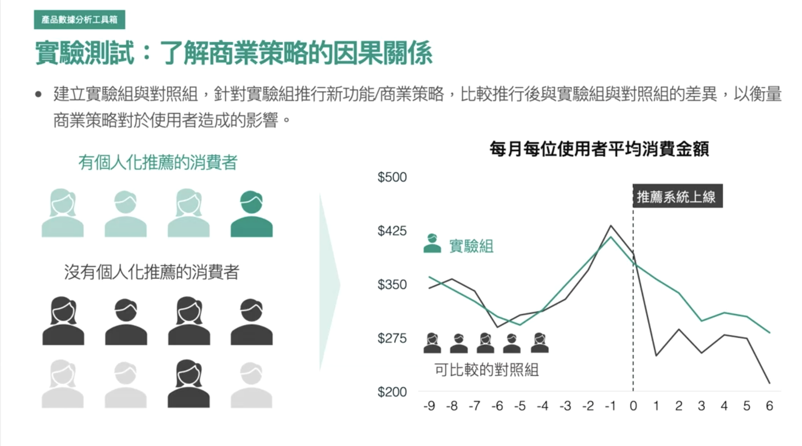

# 漏斗分析 (Funnel Analysis)

目的 : 流失的主要階段、轉換率為什麼不夠高、可能可以提升的地方 (產品斷點)

</img>

# 同類群組分析 (Cohort Analysis)

目的 : 

1. x軸 特定族群 (Cohort) 隨著時間對產品互動得表現(e.g. 流失)
2. y軸 隨著產品功能改變，每一個 Cohort 的第一的時間區段使用狀況有無成長或改善
3. 對角線 (特定的 canlendar week)，在特定時間下的行銷活動，是不是對每一個 cohort 有著類似效果還是有所區別

</img>

</img>

# 族群分析(Segment Analysis)

目的 : 分析各個不同族群的行為表現

x 軸 : 使用者型態
y 軸 : 在 App 上可產生的動作

1. 找出差異之後可產生假說(可能的產品黏著點) : 是否可以鼓勵輕度使用者執行動作 k --> 使之轉變為重度使用者?

    e.g. 

    1. IG/FB - 加入N個好友之後很容易變成重度使用者
    2. Medium - 開始寫文章後很容易變成重度使用者 / 追蹤 N 個作者後容易成為重度使用者

2. 針對性的行銷策略

</img>

# 實驗測試

目的 : 針對想要測試的商業假說進行科學化的分析(有效還是沒效)

</img>

有用的口訣 : 實驗組 / **可比較的**對照組