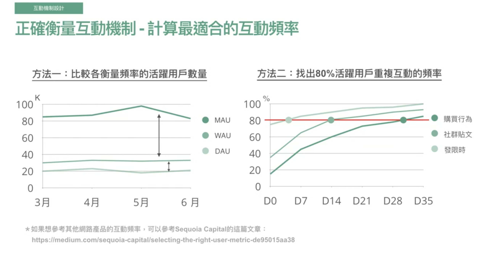

# 產品互動

</img>

</img>

* 注意力產品
  * facebook, instgram
* 交易型產品
  * shopee
* 工具型產品
  * notion, PS, AI 等專業繪圖軟體

# 互動機制設計

</img>

* 線都是往下走
* 每個步驟都有可能流失
* 使用者的 aha moment
  * 原來這個產品是這樣(完成了價值交換)
  * 需要透過產品設計來確認哪些使用者確實有經過 aha moment
* 定義關鍵步驟 --> 使用者願意持續回來使用產品
  * 產品給了使用者對應價值，且使用者有可能有可能持續和產品互動

</img>

* 以訂房app為例子，aha moment為完成交易時，中間階段適合使用漏斗分析來找尋 bottleneck，提升該階段轉化率

</img>

* 須考量當階段優化目標，如果當階段優化目標為**收益**
  * 方案三直接優化確認購買
  * 方案一二都是間接優化，要 x 下一階 & 下下階的轉化率
* 若當階段優化目標為**看到更多的飯店**
  * 那麼相關方案應該選擇 總人數 --> 瀏覽頁 相關優化

# 計算最適合的互動頻率

</img>

* 同類型產品
  * youtube 一小時內可能密集觀看，netflix 一小時內只能看一集
  * ig 貼文可能每雙週一篇，限時動態可能每3天一篇
* 跨類型產品
  * fb (注意力產品) - 每天有行為 <--> amazon(購物行產品) 特定節日、優惠時有行為
  * youtube (注意力產品) - 每天有行為 <--> airbnb(購物行產品) 假日、特定節日、優惠時有行為

</img>

* 先定義 active user : 已完成產品核心功能(e.g. 閱讀文章並且讀完50%)
* 從上左圖來看，WAU, DAU 對比起 MAU --> MAU 大幅上升，表示產品多數使用者在一個月內完成產品核心價值交換
  * 而商業策略上應該要讓使用者能夠在 Monthly Active --> BiWeekly Active --> Weekly Active

* 上右圖
  * 行為 --> color
  * y 使用者比例
  * x 切一刀為 D0，開始計算時間
  * 3天內有80%的Active User 已經發過限時動態、貼文14天、購買30天
  * 商業策略 --> 讓線往左邊靠攏